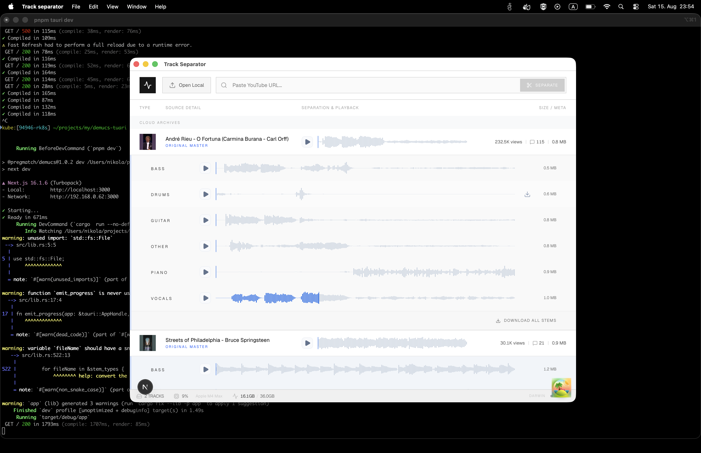

# Track Separator

A modern, high-performance desktop application built with **Tauri**, **React**, and **Rust**, powered by AI (**Demucs**) to isolate instrument stems (vocals, drums, bass, guitar, piano, and other components) from YouTube videos/shorts or local audio files.

Designed for musicians, producers, and creators who need a fast, local tool for practice, transcription, and remixing.

---



## Supported platforms

- OSX
- Linux coming soon
- Windows coming soon

## Features

* **AI-Powered Stem Separation:** Automatically separates tracks into clean stems using local AI audio processing.
* **YouTube & Local File Support:** Drop in any local audio file (`.mp3`, `.wav`, etc.) or paste a YouTube link to download and process automatically.
* **Real-Time Progress Tracking:** Live console output and progress indicators streamed directly to the UI.
* **Persistent Library (SQLite):** Keeps a history of your processed tracks, metadata, file sizes, and cached stems so you never lose your work.
* **Export Options:** Download individual stems or package everything neatly into a `.zip` archive.
* **Hardware Awareness:** Inspects system stats (CPU usage, memory, and hardware acceleration capabilities).

---

## Tech Stack

* **Frontend:** Next.js, React, TypeScript, Tailwind CSS
* **Backend / Core:** Rust, Tauri v2
* **Database:** Rusqlite (SQLite) / Tauri SQL plugin
* **Audio Fetching & Processing:** `yt-dlp`, `ffmpeg`, `ffprobe`, and Demucs

---

## Getting Started (Development)

### Prerequisites
Make sure you have the following installed on your machine:
* **Node.js** (v18+)
* **Rust** (Latest stable toolchain)

## External Binaries Required

Because of file size limits, the required external binaries (`ffmpeg`, `ffprobe`, `yt-dlp`, and `shredder`) are not included in this repository. You need to download them and place them into the `src-tauri/binaries/` folder before building or running the app.
## External Binaries Required

Because of file size limits, the required external binaries (`ffmpeg`, `ffprobe`, `yt-dlp`, and `shredder`) are not included in the source repository. You can download pre-compiled versions directly from the [GitHub Releases Page](https://github.com/goors/mp3-track-separator/releases/latest) and place them into the `src-tauri/binaries/` folder.

### Directory Structure
Ensure your `src-tauri/binaries/` directory looks like this before building or running:
```text
src-tauri/
└── binaries/
    ├── ffmpeg
    ├── ffprobe
    ├── yt-dlp
    └── shredder

